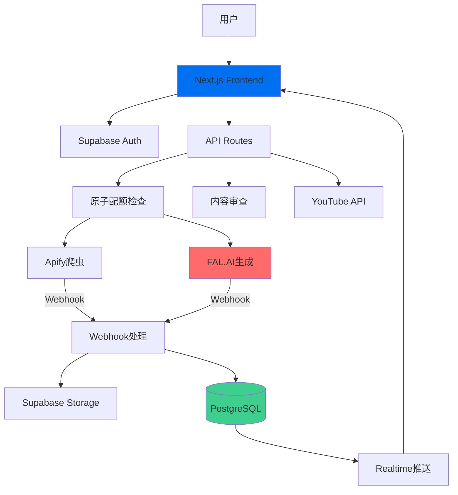

# 🎬 Jilo.ai - AI视频内容自动化工厂

> **一键发现爆款 → AI生成视频 → 自动发布YouTube**  
> 让内容创作变得像呼吸一样简单

[](LICENSE)
[](https://www.typescriptlang.org/)
[](https://nextjs.org/)
[](https://supabase.com/)

---

## 📖 目录

- [项目简介](#项目简介)
- [核心功能](#核心功能)
- [技术架构](#技术架构)
- [快速开始](#快速开始)
- [文档导航](#文档导航)
- [开发路线图](#开发路线图)
- [贡献指南](#贡献指南)

---

## 🎯 项目简介

**Jilo.ai** 是一个端到端的AI视频内容自动化平台，专为内容创作者和营销团队打造。

### 解决的核心问题

1. **选题困难** → 自动发现TikTok/YouTube爆款视频
2. **创作耗时** → AI一键生成高质量短视频  
3. **发布繁琐** → 自动发布到YouTube并优化SEO

### 目标用户

- 🎬 YouTube创作者（希望提升产出效率）
- 📱 短视频运营团队（批量内容制作）
- 🏢 企业营销部门（品牌内容传播）
- 🚀 创业者（快速测试内容方向）

---

## ✨ 核心功能

### 1️⃣ 爆款发现（Discover）

- **多平台爬取**: TikTok、YouTube Shorts、Instagram Reels
- **智能过滤**: 按播放量、互动率、发布时间筛选
- **爆款评分**: AI分析视频火爆潜力（0-100分）
- **趋势洞察**: 自动提取热门话题、音乐、标签

### 2️⃣ AI视频生成（Generate）

- **多模型支持**: 
  - Minimax Video-01（高性价比）
  - Runway Gen-3（高质量）
  - Kling AI（中文优化）
- **批量生成**: 一键生成10-100个视频变体
- **风格定制**: 写实、动漫、艺术等多种风格
- **内容审查**: AI自动过滤违规内容

### 3️⃣ 智能发布（Publish）

- **YouTube自动化**: 
  - 自动上传视频
  - AI优化标题/描述/标签
  - SEO关键词推荐
  - 最佳发布时间建议
- **多账号管理**: 支持绑定多个YouTube频道
- **定时发布**: 设置发布队列

### 4️⃣ 数据分析（Analytics）

- **实时监控**: 视频生成进度、发布状态
- **效果追踪**: 播放量、点赞数、评论数
- **ROI分析**: 成本/产出比

---

## 🏗️ 技术架构

### 前端技术栈

```
Next.js 14 (App Router)
├── React 18 (Server Components)
├── TypeScript 5.0
├── Tailwind CSS 3.4
├── shadcn/ui (组件库)
├── Framer Motion (动画)
└── Zustand (状态管理)
```

### 后端技术栈

```
Vercel (部署平台)
├── Next.js API Routes (业务逻辑)
├── Supabase (BaaS)
│   ├── PostgreSQL (数据库)
│   ├── Realtime (WebSocket)
│   ├── Storage (文件存储)
│   ├── Auth (用户认证)
│   └── Edge Functions (定时任务)
└── Webhook处理 (异步任务)
```

### 核心服务集成

| 服务 | 用途 | 文档 |
|------|------|------|
| **Apify** | 网页爬虫 | [文档](https://docs.apify.com/) |
| **FAL.AI** | 视频生成 | [文档](https://fal.ai/docs) |
| **Google Gemini** | 内容分析 | [文档](https://ai.google.dev/) |
| **YouTube Data API** | 视频上传 | [文档](https://developers.google.com/youtube) |
| **Stripe** | 订阅支付 | [文档](https://stripe.com/docs) |

### 架构图



---

## 🚀 快速开始

### 环境要求

- Node.js 18.17+ 
- pnpm 8+ (推荐) 或 npm/yarn
- Supabase账号
- Vercel账号（可选，用于部署）

### 本地开发

```bash
# 1. 克隆仓库
git clone https://github.com/372768498/shipinzidonghua1119.git
cd shipinzidonghua1119

# 2. 安装依赖
pnpm install

# 3. 配置环境变量
cp .env.local.example .env.local
# 编辑 .env.local，填入API密钥

# 4. 启动Supabase本地服务
pnpm supabase:start

# 5. 运行数据库迁移
pnpm supabase:migrate

# 6. 生成TypeScript类型
pnpm supabase:types

# 7. 启动开发服务器
pnpm dev
```

访问 http://localhost:3000

### 环境变量配置

详见 [环境变量文档](./docs/ENVIRONMENT.md)

---

## 📚 文档导航

### 产品文档
- [产品需求文档 (PRD)](./docs/PRD.md) - 完整的产品规划
- [用户手册](./docs/USER_GUIDE.md) - 使用教程
- [常见问题 (FAQ)](./docs/FAQ.md)

### 技术文档
- [架构设计文档](./docs/ARCHITECTURE.md) - 系统架构详解
- [技术实现文档](./docs/TECHNICAL_IMPLEMENTATION.md) - 核心功能实现
- [API文档](./docs/API.md) - 接口说明
- [数据库设计](./docs/DATABASE.md) - 表结构和关系

### 安全文档
- [安全审计报告](./docs/SECURITY_AUDIT.md) - 漏洞修复记录
- [隐私政策](./docs/PRIVACY.md)
- [服务条款](./docs/TERMS.md)

### 开发文档
- [开发指南](./docs/DEVELOPMENT.md) - 开发规范
- [部署文档](./docs/DEPLOYMENT.md) - 部署流程
- [贡献指南](./docs/CONTRIBUTING.md)

---

## 🗓️ 开发路线图

### ✅ Phase 1 - MVP (已完成)
- [x] 用户认证系统
- [x] 爆款视频爬取
- [x] AI视频生成
- [x] YouTube发布
- [x] 订阅付费

### 🚧 Phase 2 - Beta (进行中)
- [ ] 批量生成优化
- [ ] 视频编辑功能
- [ ] 数据分析Dashboard
- [ ] 移动端适配

### 📋 Phase 3 - V1.0 (规划中)
- [ ] 多语言支持
- [ ] 团队协作功能
- [ ] API开放平台
- [ ] 白标解决方案

---

## 🤝 贡献指南

我们欢迎所有形式的贡献！

### 如何贡献

1. Fork本仓库
2. 创建功能分支 (`git checkout -b feature/AmazingFeature`)
3. 提交更改 (`git commit -m 'Add some AmazingFeature'`)
4. 推送到分支 (`git push origin feature/AmazingFeature`)
5. 提交Pull Request

详见 [贡献指南](./docs/CONTRIBUTING.md)

---

## 📄 许可证

本项目采用 MIT 许可证 - 详见 [LICENSE](LICENSE) 文件

---

## 🙏 致谢

感谢以下开源项目和服务：

- [Next.js](https://nextjs.org/) - React框架
- [Supabase](https://supabase.com/) - 开源Firebase替代品
- [shadcn/ui](https://ui.shadcn.com/) - UI组件库
- [Vercel](https://vercel.com/) - 部署平台

---

## 📞 联系我们

- 📧 Email: support@jilo.ai
- 💬 Discord: [加入社区](https://discord.gg/jilo)
- 🐦 Twitter: [@JiloAI](https://twitter.com/JiloAI)
- 📝 博客: [blog.jilo.ai](https://blog.jilo.ai)

---

<div align="center">

**[⬆ 回到顶部](#-jiloai---ai视频内容自动化工厂)**

Made with ❤️ by Jilo.ai Team

</div>
