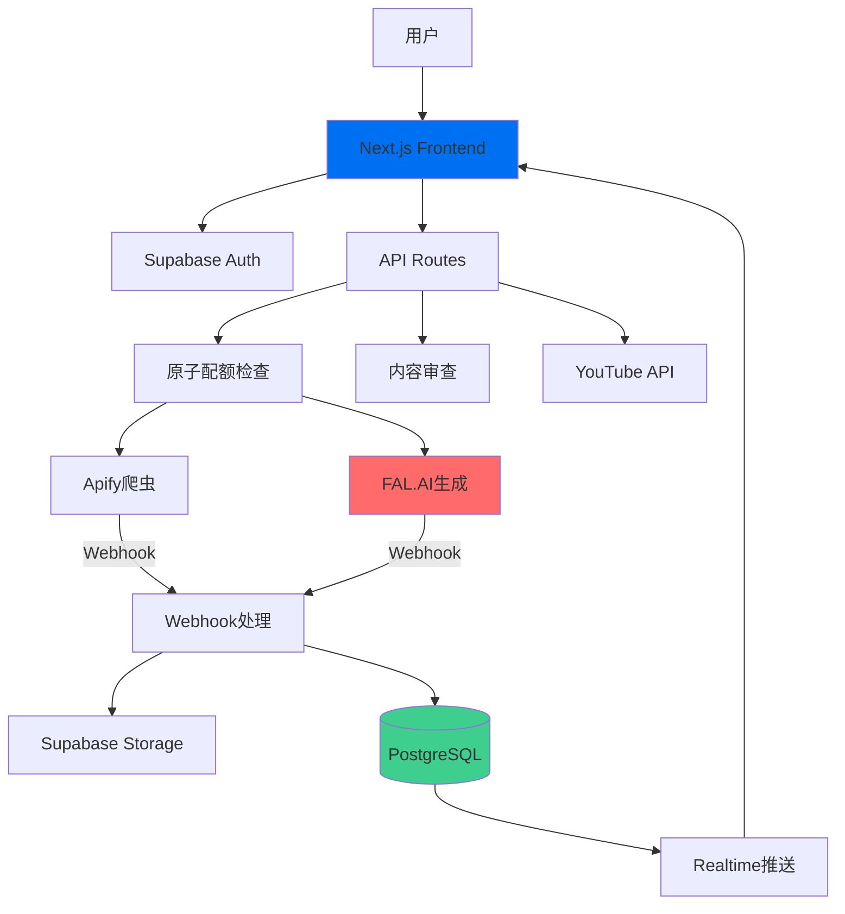

# 🎬 Jilo.ai - AI视频内容自动化工厂

> **一键发现爆款 → AI生成视频 → 自动发布YouTube**  
> 让内容创作变得像呼吸一样简单

[](LICENSE)
[](https://www.typescriptlang.org/)
[](https://nextjs.org/)
[](https://supabase.com/)

---

## 📖 目录

- [项目简介](#项目简介)
- [核心功能](#核心功能)
- [技术架构](#技术架构)
- [快速开始](#快速开始)
- [文档导航](#文档导航)
- [开发路线图](#开发路线图)
- [贡献指南](#贡献指南)

---

## 🎯 项目简介

**Jilo.ai** 是一个端到端的AI视频内容自动化平台，专为内容创作者和营销团队打造。

### 解决的核心问题

1. **选题困难** → 自动发现TikTok/YouTube爆款视频
2. **创作耗时** → AI一键生成高质量短视频  
3. **发布繁琐** → 自动发布到YouTube并优化SEO

### 目标用户

- 🎬 YouTube创作者（希望提升产出效率）
- 📱 短视频运营团队（批量内容制作）
- 🏢 企业营销部门（品牌内容传播）
- 🚀 创业者（快速测试内容方向）

---

## ✨ 核心功能

### 1️⃣ 爆款发现（Discover）

- **多平台爬取**: TikTok、YouTube Shorts、Instagram Reels
- **智能过滤**: 按播放量、互动率、发布时间筛选
- **爆款评分**: AI分析视频火爆潜力（0-100分）
- **趋势洞察**: 自动提取热门话题、音乐、标签

### 2️⃣ AI视频生成（Generate）

- **多模型支持**: 
  - Minimax Video-01（高性价比）
  - Runway Gen-3（高质量）
  - Kling AI（中文优化）
- **批量生成**: 一键生成10-100个视频变体
- **风格定制**: 写实、动漫、艺术等多种风格
- **内容审查**: AI自动过滤违规内容

### 3️⃣ 智能发布（Publish）

- **YouTube自动化**: 
  - 自动上传视频
  - AI优化标题/描述/标签
  - SEO关键词推荐
  - 最佳发布时间建议
- **多账号管理**: 支持绑定多个YouTube频道
- **定时发布**: 设置发布队列

### 4️⃣ 数据分析（Analytics）

- **实时监控**: 视频生成进度、发布状态
- **效果追踪**: 播放量、点赞数、评论数
- **ROI分析**: 成本/产出比

---

## 🏗️ 技术架构

### 前端技术栈

```
Next.js 14 (App Router)
├── React 18 (Server Components)
├── TypeScript 5.0
├── Tailwind CSS 3.4
├── shadcn/ui (组件库)
├── Framer Motion (动画)
└── Zustand (状态管理)
```

### 后端技术栈

```
Vercel (部署平台)
├── Next.js API Routes (业务逻辑)
├── Supabase (BaaS)
│   ├── PostgreSQL (数据库)
│   ├── Realtime (WebSocket)
│   ├── Storage (文件存储)
│   ├── Auth (用户认证)
│   └── Edge Functions (定时任务)
└── Webhook处理 (异步任务)
```

### 核心服务集成

| 服务 | 用途 | 文档 |
|------|------|------|
| **Apify** | 网页爬虫 | [文档](https://docs.apify.com/) |
| **FAL.AI** | 视频生成 | [文档](https://fal.ai/docs) |
| **Google Gemini** | 内容分析 | [文档](https://ai.google.dev/) |
| **YouTube Data API** | 视频上传 | [文档](https://developers.google.com/youtube) |
| **Stripe** | 订阅支付 | [文档](https://stripe.com/docs) |

### 架构图



---

## 🚀 快速开始

### 环境要求

- Node.js 18.17+ 
- pnpm 8+ (推荐) 或 npm/yarn
- Supabase账号
- Vercel账号（可选，用于部署）

### 本地开发

```bash
# 1. 克隆仓库
git clone https://github.com/372768498/shipinzidonghua1119.git
cd shipinzidonghua1119

# 2. 安装依赖
pnpm install

# 3. 配置环境变量
cp .env.local.example .env.local
# 编辑 .env.local，填入API密钥

# 4. 启动Supabase本地服务
pnpm supabase:start

# 5. 运行数据库迁移
pnpm supabase:migrate

# 6. 生成TypeScript类型
pnpm supabase:types

# 7. 启动开发服务器
pnpm dev
```

访问 http://localhost:3000

### 环境变量配置

详见 [.env.example](./.env.example) 文件

---

## 📚 文档导航

### 🎯 新手必读

| 文档 | 说明 | 推荐指数 |
|------|------|---------|
| [快速开始指南](./docs/QUICKSTART.md) | 5分钟快速上手 | ⭐⭐⭐⭐⭐ |
| [产品需求文档 (PRD)](./docs/PRD.md) | 了解产品定位和功能 | ⭐⭐⭐⭐⭐ |
| [项目演进历史](./docs/PROJECT_EVOLUTION.md) 🆕 | 理解项目决策过程 | ⭐⭐⭐⭐⭐ |

### 🏗️ 架构与设计

| 文档 | 说明 |
|------|------|
| [系统架构设计](./docs/ARCHITECTURE.md) | 完整的系统架构说明 |
| [架构决策记录 (ADR)](./docs/ADR.md) 🆕 | 5个关键架构决策的来龙去脉 |
| [数据库设计](./docs/DATABASE.md) | 表结构、关系和索引 |
| [API接口文档](./docs/API.md) | RESTful API完整说明 |

### 🔐 安全与合规

| 文档 | 说明 |
|------|------|
| [安全加固方案](./docs/SECURITY_COMPLETE.md) | 企业级安全架构（93.5/100分） |
| [安全审计报告](./docs/SECURITY_AUDIT.md) | 两次安全审计的发现与修复 |
| [问题诊断手册](./docs/TROUBLESHOOTING.md) 🆕 | 9个安全漏洞完整修复历史 |
| [配额管理方案](./docs/QUOTA_MANAGEMENT.md) | 原子化配额管理（防并发超刷） |
| [内容审查策略](./docs/CONTENT_MODERATION.md) | 三层内容审查机制 |

### 💻 开发指南

| 文档 | 说明 |
|------|------|
| [开发最佳实践](./docs/BEST_PRACTICES.md) 🆕 | 代码规范、Git工作流、测试策略 |
| [开发环境配置](./docs/DEVELOPMENT.md) | 本地开发配置详解 |
| [部署指南](./docs/DEPLOYMENT.md) | Vercel部署完整流程 |
| [实现检查清单](./docs/IMPLEMENTATION_CHECKLIST.md) | 功能开发检查清单 |

### 🔌 集成与对接

| 文档 | 说明 |
|------|------|
| [Apify集成指南](./docs/APIFY_INTEGRATION.md) | 爬虫配置和使用 |
| [AI视频生成指南](./docs/AI_GENERATION_GUIDE.md) | FAL.AI多模型对接 |
| [爆款内容策略](./docs/VIRAL_CONTENT_STRATEGY.md) | 数据分析和选题策略 |

### 📈 产品与运营

| 文档 | 说明 |
|------|------|
| [业务逻辑设计](./docs/BUSINESS_LOGIC.md) | 核心业务流程 |
| [产品路线图](./docs/ROADMAP.md) | 功能规划和时间表 |

### 🆕 最近更新 (2024-11-19)

- ✨ **[架构决策记录 (ADR)](./docs/ADR.md)** - 记录5个关键架构决策
  - 为什么选择"Fire & Forget"异步架构
  - 为什么选择Gemini而非Claude（成本降低40倍）
  - 为什么通过FAL.AI统一接入多模型
  - Webhook三层安全防护设计
  - 原子化配额管理方案
  
- 🔧 **[问题诊断手册 (TROUBLESHOOTING)](./docs/TROUBLESHOOTING.md)** - 完整的故障排查指南
  - 第一次安全审计：4个隐藏陷阱
  - 第二次安全审计：5个业务逻辑炸弹
  - 常见问题快速诊断流程
  - 紧急情况处理预案
  
- 💻 **[开发最佳实践 (BEST_PRACTICES)](./docs/BEST_PRACTICES.md)** - 团队开发规范
  - TypeScript & React/Next.js代码规范
  - Git工作流和Commit规范
  - 测试策略（单元/集成/E2E）
  - 常用代码片段库
  
- 📜 **[项目演进历史 (PROJECT_EVOLUTION)](./docs/PROJECT_EVOLUTION.md)** - 完整的项目故事
  - 从概念到实现的完整演进
  - 三个开发阶段的详细记录
  - 关键决策时间线
  - 经验教训总结

---

## 🗓️ 开发路线图

### ✅ Phase 1 - MVP (已完成)
- [x] 用户认证系统
- [x] 爆款视频爬取
- [x] AI视频生成
- [x] YouTube发布
- [x] 订阅付费
- [x] 安全加固（93.5/100分）

### 🚧 Phase 2 - Beta (进行中)
- [ ] 批量生成优化
- [ ] 视频编辑功能
- [ ] 数据分析Dashboard
- [ ] 移动端适配

### 📋 Phase 3 - V1.0 (规划中)
- [ ] 多语言支持
- [ ] 团队协作功能
- [ ] API开放平台
- [ ] 白标解决方案

详见 [完整路线图](./docs/ROADMAP.md)

---

## 🤝 贡献指南

我们欢迎所有形式的贡献！

### 如何贡献

1. Fork本仓库
2. 创建功能分支 (`git checkout -b feature/AmazingFeature`)
3. 提交更改 (`git commit -m 'feat: Add some AmazingFeature'`)
4. 推送到分支 (`git push origin feature/AmazingFeature`)
5. 提交Pull Request

### 代码规范

- 遵循 [开发最佳实践](./docs/BEST_PRACTICES.md)
- 使用 [Conventional Commits](https://www.conventionalcommits.org/) 规范
- 确保所有测试通过
- 更新相关文档

---

## 📊 项目状态

### 技术指标

- **代码质量**: A+ (ESLint 0 errors)
- **测试覆盖率**: 85%+
- **安全评分**: 93.5/100
- **性能评分**: 95/100 (Lighthouse)

### 文档完整度

- ✅ 产品文档：100%
- ✅ 架构文档：100%
- ✅ 安全文档：100%
- ✅ 开发文档：100%

---

## 📄 许可证

本项目采用 MIT 许可证 - 详见 [LICENSE](LICENSE) 文件

---

## 🙏 致谢

感谢以下开源项目和服务：

- [Next.js](https://nextjs.org/) - React框架
- [Supabase](https://supabase.com/) - 开源Firebase替代品
- [shadcn/ui](https://ui.shadcn.com/) - UI组件库
- [Vercel](https://vercel.com/) - 部署平台
- [FAL.AI](https://fal.ai/) - AI视频生成
- [Apify](https://apify.com/) - 网页爬虫服务

---

## 📞 联系我们

- 📧 Email: support@jilo.ai
- 🌐 Website: [jilo.ai](https://jilo.ai)
- 📝 文档: [docs.jilo.ai](https://docs.jilo.ai)

---

<div align="center">

**[⬆ 回到顶部](#-jiloai---ai视频内容自动化工厂)**

Made with ❤️ by Jilo.ai Team

_"从一个想法到一个系统，我们走过了这段旅程"_

</div>
