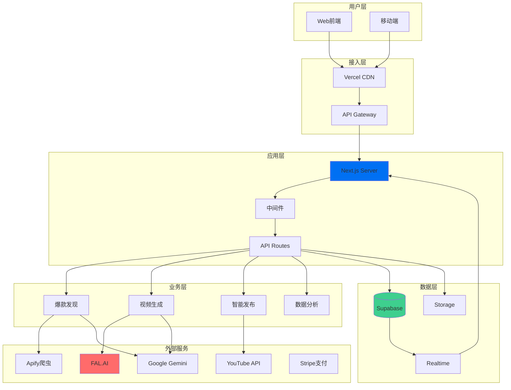
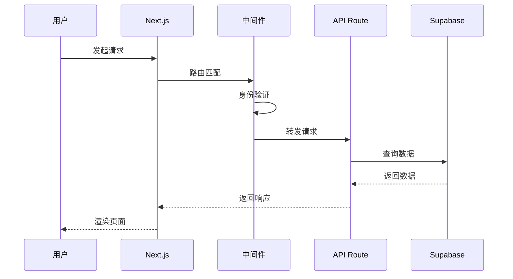
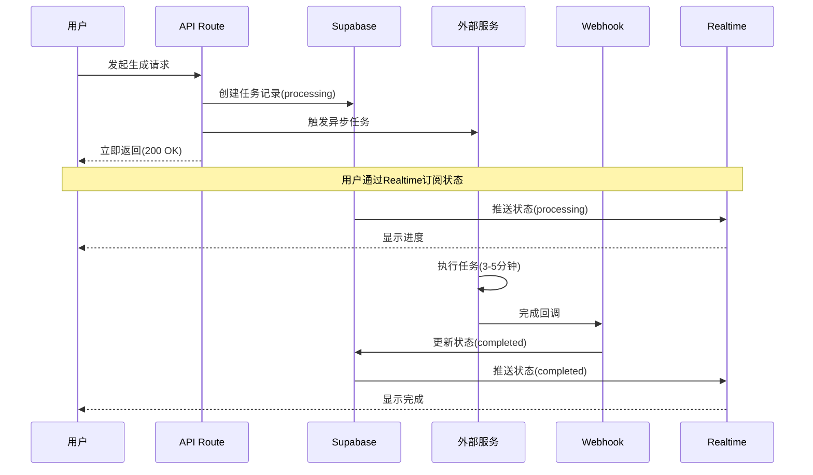
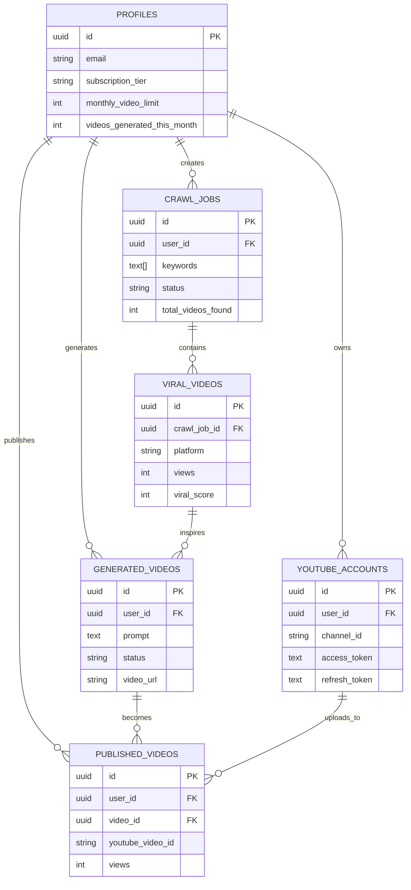

# 🏗️ 系统架构设计文档

> **项目**: Jilo.ai  
> **版本**: V1.0  
> **更新日期**: 2024-11-19

---

## 📑 目录

1. [架构概览](#1-架构概览)
2. [技术选型](#2-技术选型)
3. [系统架构](#3-系统架构)
4. [数据库设计](#4-数据库设计)
5. [API设计](#5-api设计)
6. [安全架构](#6-安全架构)
7. [性能优化](#7-性能优化)
8. [监控告警](#8-监控告警)

---

## 1. 架构概览

### 1.1 核心设计原则

**SOLID原则**:
- ✅ **单一职责**: 每个模块只做一件事
- ✅ **开闭原则**: 易扩展，不修改
- ✅ **依赖倒置**: 面向接口编程

**架构特点**:
- 🚀 **Serverless优先**: 无需管理服务器
- ⚡ **异步处理**: 长任务不阻塞用户
- 🔄 **实时反馈**: WebSocket推送状态
- 🛡️ **安全第一**: 多层防护

### 1.2 高层架构图



---

## 2. 技术选型

### 2.1 前端技术栈

| 技术 | 版本 | 用途 | 选型理由 |
|------|------|------|----------|
| **Next.js** | 14.2+ | React框架 | SSR/SSG支持，SEO友好，Vercel部署 |
| **React** | 18+ | UI库 | 生态成熟，Server Components |
| **TypeScript** | 5.0+ | 类型系统 | 类型安全，减少Bug |
| **Tailwind CSS** | 3.4+ | 样式框架 | 快速开发，一致性 |
| **shadcn/ui** | Latest | 组件库 | 高质量组件，可定制 |
| **Zustand** | 4.5+ | 状态管理 | 轻量简单，性能好 |
| **Framer Motion** | 11+ | 动画库 | 流畅动画，易用 |

### 2.2 后端技术栈

| 技术 | 版本 | 用途 | 选型理由 |
|------|------|------|----------|
| **Vercel** | - | 部署平台 | 零配置，边缘网络 |
| **Supabase** | Latest | BaaS | 开源，功能全面 |
| **PostgreSQL** | 15+ | 数据库 | 可靠，功能强大 |
| **Node.js** | 18+ | 运行时 | Stream支持 |

### 2.3 第三方服务

| 服务 | 用途 | 月成本 | 备选方案 |
|------|------|--------|----------|
| **Apify** | 爬虫服务 | $49+ | Puppeteer自建 |
| **FAL.AI** | 视频生成 | 按量付费 | Runway, Kling |
| **Google Gemini** | 内容分析 | 免费层 | OpenAI GPT-4 |
| **YouTube API** | 视频上传 | 免费 | - |
| **Stripe** | 支付 | 2.9%+$0.3 | Paddle |

---

## 3. 系统架构

### 3.1 请求处理流程

#### 同步请求（快速响应）



#### 异步请求（长任务）



### 3.2 核心业务流程

#### 流程1: 爆款视频爬取

```
┌─────────────────────────────────────────────┐
│ 1. 用户输入关键词                             │
└─────────────────┬───────────────────────────┘
                  ↓
┌─────────────────────────────────────────────┐
│ 2. API验证配额（原子RPC）                    │
│    - 检查剩余配额                             │
│    - 扣除配额（FOR UPDATE锁）                │
└─────────────────┬───────────────────────────┘
                  ↓
┌─────────────────────────────────────────────┐
│ 3. 创建爬取任务                               │
│    - status: processing                      │
│    - 插入crawl_jobs表                        │
└─────────────────┬───────────────────────────┘
                  ↓
┌─────────────────────────────────────────────┐
│ 4. 触发Apify爬虫                             │
│    - 传入Webhook URL（带Secret）             │
│    - Fire & Forget（不等结果）               │
└─────────────────┬───────────────────────────┘
                  ↓
┌─────────────────────────────────────────────┐
│ 5. 立即返回用户                               │
│    - jobId                                   │
│    - status: processing                      │
└─────────────────────────────────────────────┘

═══════════ 异步处理（Apify执行中）═══════════

┌─────────────────────────────────────────────┐
│ 6. Apify完成爬取（2-5分钟后）                │
│    - 回调Webhook                             │
│    - 携带数据集ID                            │
└─────────────────┬───────────────────────────┘
                  ↓
┌─────────────────────────────────────────────┐
│ 7. Webhook处理                               │
│    - 验证Secret                              │
│    - 下载数据集                              │
│    - 计算爆款评分                            │
│    - 插入viral_videos表                      │
└─────────────────┬───────────────────────────┘
                  ↓
┌─────────────────────────────────────────────┐
│ 8. 更新任务状态                               │
│    - status: completed                       │
│    - Supabase自动推送Realtime                │
└─────────────────┬───────────────────────────┘
                  ↓
┌─────────────────────────────────────────────┐
│ 9. 前端收到更新                               │
│    - 自动刷新视频列表                         │
│    - 显示爆款视频                            │
└─────────────────────────────────────────────┘
```

#### 流程2: AI视频生成

```
前端触发生成
     ↓
内容安全审查（Gemini）
     ↓
  审查通过？
     ↓ YES
原子配额扣费
     ↓
  配额足够？
     ↓ YES
创建生成任务
     ↓
触发FAL.AI
     ↓
FAL执行生成（3-10分钟）
     ↓
完成回调Webhook
     ↓
下载视频文件
     ↓
上传到Supabase Storage（流式）
     ↓
获取永久URL
     ↓
更新任务状态
     ↓
Realtime推送前端
     ↓
用户看到视频
```

---

## 4. 数据库设计

### 4.1 ER图



### 4.2 核心表结构

详见 [数据库设计文档](./DATABASE.md)

---

## 5. API设计

### 5.1 RESTful API规范

**命名规范**:
```
GET    /api/videos          # 获取列表
GET    /api/videos/:id      # 获取详情
POST   /api/videos          # 创建
PUT    /api/videos/:id      # 更新
DELETE /api/videos/:id      # 删除
```

**响应格式**:
```typescript
// 成功响应
{
  "success": true,
  "data": {...},
  "message": "操作成功"
}

// 错误响应
{
  "success": false,
  "error": "ERROR_CODE",
  "message": "错误描述"
}
```

### 5.2 核心API端点

| 端点 | 方法 | 功能 | 认证 |
|------|------|------|------|
| `/api/crawl/start` | POST | 启动爬取 | ✅ |
| `/api/generate/video` | POST | 生成视频 | ✅ |
| `/api/publish/youtube` | POST | 发布YouTube | ✅ |
| `/api/webhooks/apify` | POST | Apify回调 | Secret |
| `/api/webhooks/fal` | POST | FAL回调 | Secret |
| `/api/webhooks/stripe` | POST | Stripe回调 | 签名 |

详见 [API文档](./API.md)

---

## 6. 安全架构

### 6.1 多层防护

```
┌─────────────────────────────────────┐
│ Layer 1: 边缘防护                    │
│ - Vercel DDoS保护                   │
│ - Rate Limiting                     │
│ - CDN缓存                           │
└─────────────────┬───────────────────┘
                  ↓
┌─────────────────────────────────────┐
│ Layer 2: 应用层防护                  │
│ - Middleware认证                    │
│ - CSRF Token                        │
│ - XSS过滤                           │
└─────────────────┬───────────────────┘
                  ↓
┌─────────────────────────────────────┐
│ Layer 3: 业务逻辑防护                │
│ - 原子配额扣费（防超刷）            │
│ - 内容AI审查（防违规）              │
│ - Webhook签名验证                   │
└─────────────────┬───────────────────┘
                  ↓
┌─────────────────────────────────────┐
│ Layer 4: 数据层防护                  │
│ - RLS行级安全                       │
│ - Token加密存储（AES-256）          │
│ - SQL注入防护                       │
└─────────────────────────────────────┘
```

### 6.2 安全措施清单

详见 [安全审计报告](./SECURITY_AUDIT.md)

---

## 7. 性能优化

### 7.1 前端优化

- ✅ **代码分割**: 按路由动态加载
- ✅ **图片优化**: Next/Image自动优化
- ✅ **预加载**: 关键资源prefetch
- ✅ **缓存策略**: SWR + localStorage

### 7.2 后端优化

- ✅ **数据库索引**: 关键字段加索引
- ✅ **连接池**: Supabase自动管理
- ✅ **查询优化**: 避免N+1问题
- ✅ **CDN缓存**: 静态资源边缘缓存

### 7.3 流式处理

**大文件上传优化**:
```typescript
// ❌ 不好：读入内存
const blob = await response.blob()
await storage.upload(path, blob)

// ✅ 好：流式传输
const stream = Readable.fromWeb(response.body)
await storage.upload(path, stream)
```

---

## 8. 监控告警

### 8.1 监控指标

| 指标 | 工具 | 阈值 | 告警 |
|------|------|------|------|
| **可用性** | Vercel Analytics | <99.9% | 邮件 |
| **响应时间** | Vercel Logs | >2s | Slack |
| **错误率** | Sentry | >1% | PagerDuty |
| **数据库负载** | Supabase Dashboard | >80% | 邮件 |

### 8.2 日志系统

```typescript
// 结构化日志
console.log(JSON.stringify({
  level: 'info',
  timestamp: new Date().toISOString(),
  service: 'api',
  endpoint: '/api/generate/video',
  userId: user.id,
  duration: 1234,
  status: 'success'
}))
```

---

## 📎 附录

### A. 技术债务

| 问题 | 影响 | 优先级 | 计划 |
|------|------|--------|------|
| 缺少E2E测试 | 回归风险高 | P1 | Q1 2025 |
| 数据库未分区 | 查询变慢 | P2 | Q2 2025 |
| 无降级策略 | 服务不稳定 | P1 | Q1 2025 |

### B. 扩展性考虑

**水平扩展**:
- Vercel自动扩展
- Supabase支持横向扩展
- 无状态设计

**垂直扩展**:
- 升级Supabase套餐
- 优化数据库查询
- 增加缓存层（Redis）

---

<div align="center">

**[返回文档首页](../README.md)** | **[查看API文档](./API.md)**

</div>