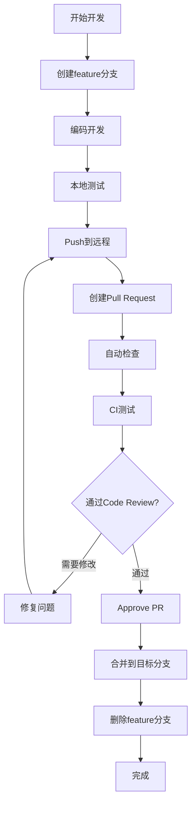

# 🌳 Git工作流程规范 (Git Workflow)

> **文档目的**: 定义Jilo.ai项目的Git分支管理、提交规范和协作流程  
> **创建日期**: 2024-11-19  
> **版本**: V1.0  
> **适用于**: 所有开发团队成员

---

## 📋 目录

1. [分支策略](#分支策略)
2. [提交规范](#提交规范)
3. [PR流程](#pr流程)
4. [版本管理](#版本管理)
5. [常见场景](#常见场景)
6. [最佳实践](#最佳实践)

---

## 分支策略

### 🌲 分支模型

我们采用 **Git Flow 简化版** + **特性分支**模型：

```
main (生产环境)
  ↑
  └── develop (开发主分支)
        ↑
        ├── feature/xxx (功能分支)
        ├── bugfix/xxx (Bug修复分支)
        ├── hotfix/xxx (紧急修复分支)
        └── release/vX.X.X (发布分支)
```

### 📦 分支类型详解

#### 1. main 分支
```bash
# 用途: 生产环境代码
# 规则:
- 只能通过PR合并，不能直接push
- 每次合并都应该打tag
- 必须保持随时可部署的状态
- 需要至少1个审核通过才能合并

# 保护规则 (GitHub Settings)
✅ Require pull request reviews before merging
✅ Require status checks to pass before merging
✅ Require branches to be up to date before merging
✅ Include administrators
```

#### 2. develop 分支
```bash
# 用途: 开发主分支，集成所有功能
# 规则:
- 从main创建
- 作为feature分支的源头
- 定期合并到main发布
- 保持相对稳定

# 创建方式
git checkout -b develop main
git push -u origin develop
```

#### 3. feature 分支
```bash
# 命名规范: feature/功能描述
# 示例:
feature/video-generation
feature/youtube-oauth
feature/quota-management
feature/apify-integration

# 创建流程
git checkout develop
git pull origin develop
git checkout -b feature/video-generation
# ... 开发 ...
git push -u origin feature/video-generation

# 合并流程
# 1. 更新develop
git checkout develop
git pull origin develop

# 2. rebase到最新
git checkout feature/video-generation
git rebase develop

# 3. 创建PR: feature/xxx -> develop
```

#### 4. bugfix 分支
```bash
# 命名规范: bugfix/问题描述
# 示例:
bugfix/quota-race-condition
bugfix/webhook-signature-validation
bugfix/video-upload-timeout

# 流程同feature分支
```

#### 5. hotfix 分支
```bash
# 命名规范: hotfix/紧急问题描述
# 示例:
hotfix/security-vulnerability
hotfix/payment-failure
hotfix/production-crash

# 流程 (紧急修复，跳过develop)
git checkout main
git pull origin main
git checkout -b hotfix/security-vulnerability
# ... 修复 ...
git push -u origin hotfix/security-vulnerability

# 创建PR: hotfix/xxx -> main
# 合并后，将main合并回develop
git checkout develop
git merge main
git push origin develop
```

#### 6. release 分支
```bash
# 命名规范: release/vX.X.X
# 示例:
release/v1.0.0
release/v1.1.0
release/v2.0.0

# 流程
# 1. 从develop创建release分支
git checkout develop
git pull origin develop
git checkout -b release/v1.0.0

# 2. 更新版本号
# package.json: "version": "1.0.0"
# .env: APP_VERSION=1.0.0

# 3. 最后的bug修复和测试
# 只做bug修复，不添加新功能

# 4. 合并到main和develop
git checkout main
git merge release/v1.0.0
git tag -a v1.0.0 -m "Release version 1.0.0"
git push origin main --tags

git checkout develop
git merge release/v1.0.0
git push origin develop

# 5. 删除release分支
git branch -d release/v1.0.0
git push origin --delete release/v1.0.0
```

---

## 提交规范

### 📝 Commit Message格式

我们使用 **Conventional Commits** 规范：

```
<type>(<scope>): <subject>

<body>

<footer>
```

#### Type类型

| Type | 说明 | 示例 |
|------|------|------|
| `feat` | 新功能 | `feat(video): 添加视频生成功能` |
| `fix` | Bug修复 | `fix(quota): 修复配额扣除的并发问题` |
| `docs` | 文档更新 | `docs(api): 更新API文档` |
| `style` | 代码格式（不影响功能） | `style: 格式化代码` |
| `refactor` | 重构（不是新功能也不是bug修复） | `refactor(auth): 重构认证逻辑` |
| `perf` | 性能优化 | `perf(db): 优化数据库查询性能` |
| `test` | 添加或修改测试 | `test(quota): 添加配额管理单元测试` |
| `chore` | 构建过程或辅助工具的变动 | `chore: 更新依赖包` |
| `ci` | CI配置文件和脚本的变动 | `ci: 添加GitHub Actions` |
| `build` | 影响构建系统或外部依赖的更改 | `build: 升级Next.js到14.2` |
| `revert` | 回滚之前的commit | `revert: 回滚视频生成功能` |

#### Scope范围

常用scope：

```
auth        - 认证相关
video       - 视频生成
discover    - 爆款发现
publish     - 发布功能
quota       - 配额管理
payment     - 支付相关
db          - 数据库
api         - API接口
ui          - UI组件
webhook     - Webhook处理
security    - 安全相关
```

#### Subject主题

- 使用祈使句，现在时态
- 首字母小写
- 不要以句号结尾
- 限制在50个字符内

```bash
# ✅ 好的示例
feat(video): add minimax model support
fix(quota): resolve race condition in deduction
docs(api): update authentication guide

# ❌ 不好的示例
feat: Added new feature.
fixed bug
update
```

#### Body正文（可选）

- 详细描述改动
- 说明改动的原因
- 与之前行为的对比

```bash
git commit -m "feat(video): add video preview before publish

- Add video player component
- Implement preview modal
- Add download button

This allows users to review their generated videos
before publishing to YouTube, reducing errors.
"
```

#### Footer页脚（可选）

- 关闭Issue: `Closes #123`
- Breaking Changes: `BREAKING CHANGE: xxx`

```bash
git commit -m "feat(api): redesign authentication API

BREAKING CHANGE: The authentication endpoint has changed
from /api/auth to /api/v2/auth. Update all API calls.

Closes #234
"
```

### 🔍 提交检查清单

每次提交前检查：

```bash
# ✅ 提交检查清单
□ 代码已格式化 (Prettier)
□ 通过ESLint检查
□ 通过TypeScript编译
□ 相关测试已通过
□ 提交信息符合规范
□ 没有包含敏感信息（API密钥等）
□ 文件大小合理（单个文件<1MB）
```

### 🛠️ 提交工具配置

#### 安装commitlint

```bash
# 安装依赖
npm install --save-dev @commitlint/cli @commitlint/config-conventional
npm install --save-dev husky

# 配置commitlint
echo "module.exports = {extends: ['@commitlint/config-conventional']}" > commitlint.config.js

# 配置husky
npx husky install
npx husky add .husky/commit-msg 'npx --no -- commitlint --edit "$1"'
```

#### package.json配置

```json
{
  "scripts": {
    "commit": "git-cz",
    "prepare": "husky install"
  },
  "devDependencies": {
    "@commitlint/cli": "^18.4.3",
    "@commitlint/config-conventional": "^18.4.3",
    "commitizen": "^4.3.0",
    "cz-conventional-changelog": "^3.3.0",
    "husky": "^8.0.3"
  },
  "config": {
    "commitizen": {
      "path": "./node_modules/cz-conventional-changelog"
    }
  }
}
```

---

## PR流程

### 🔄 Pull Request流程



### 📋 PR模板

创建 `.github/PULL_REQUEST_TEMPLATE.md`:

```markdown
## 🎯 变更类型
<!-- 请勾选适用的选项 -->
- [ ] 新功能 (feat)
- [ ] Bug修复 (fix)
- [ ] 重构 (refactor)
- [ ] 文档更新 (docs)
- [ ] 其他 (请说明)

## 📝 变更描述
<!-- 简要描述这个PR的目的和改动 -->


## 🔗 相关Issue
<!-- 如果有相关Issue，请链接 -->
Closes #

## 🧪 测试
<!-- 描述如何测试这些变更 -->
- [ ] 单元测试已通过
- [ ] 集成测试已通过
- [ ] 手动测试已完成

## 📸 截图/录屏
<!-- 如果有UI变更，请提供截图或录屏 -->


## ⚠️ Breaking Changes
<!-- 如果有破坏性变更，请详细说明 -->
- [ ] 无破坏性变更
- [ ] 有破坏性变更 (请在下方说明)


## ✅ 检查清单
- [ ] 代码符合项目规范
- [ ] 已添加必要的测试
- [ ] 文档已更新
- [ ] 所有测试通过
- [ ] 提交信息符合规范
- [ ] 已在本地测试
```

### 👁️ Code Review清单

审查者检查：

```markdown
## 代码质量
- [ ] 代码逻辑清晰易懂
- [ ] 变量和函数命名合理
- [ ] 没有重复代码
- [ ] 错误处理完善
- [ ] 边界条件考虑完整

## 性能
- [ ] 没有性能问题（N+1查询、死循环等）
- [ ] 数据库查询优化
- [ ] 适当使用缓存

## 安全
- [ ] 输入验证完善
- [ ] 没有SQL注入风险
- [ ] 没有XSS风险
- [ ] 敏感信息已加密
- [ ] 权限检查完整

## 测试
- [ ] 单元测试覆盖关键逻辑
- [ ] 测试用例充分
- [ ] 边界测试完整

## 文档
- [ ] 复杂逻辑有注释
- [ ] API文档已更新
- [ ] README已更新（如需要）
```

### 🚀 合并策略

```bash
# 1. Squash and Merge (推荐用于feature分支)
# 优点: 保持主分支历史清晰
# 缺点: 丢失详细提交历史
git merge --squash feature/video-generation

# 2. Merge Commit (用于release和hotfix)
# 优点: 保留完整历史
# 缺点: 主分支历史复杂
git merge --no-ff release/v1.0.0

# 3. Rebase and Merge (用于小改动)
# 优点: 线性历史
# 缺点: 改写历史
git rebase develop
```

---

## 版本管理

### 🏷️ 版本号规范 (SemVer)

使用语义化版本：`MAJOR.MINOR.PATCH`

```
v1.2.3
│ │ │
│ │ └─ PATCH: Bug修复
│ └─── MINOR: 新功能（向后兼容）
└───── MAJOR: 破坏性变更
```

#### 版本递增规则

```bash
# MAJOR版本 (1.0.0 -> 2.0.0)
- 不兼容的API变更
- 重大功能重构
- 数据库结构大改

# MINOR版本 (1.0.0 -> 1.1.0)
- 新增功能
- 功能增强
- 向后兼容

# PATCH版本 (1.0.0 -> 1.0.1)
- Bug修复
- 性能优化
- 安全补丁
```

### 🏷️ Git Tag规范

```bash
# 创建annotated tag
git tag -a v1.0.0 -m "Release version 1.0.0"

# 推送tag
git push origin v1.0.0

# 推送所有tag
git push origin --tags

# 查看所有tag
git tag -l

# 删除本地tag
git tag -d v1.0.0

# 删除远程tag
git push origin --delete v1.0.0
```

### 📄 CHANGELOG规范

创建 `CHANGELOG.md`:

```markdown
# Changelog

所有重要的变更都会记录在这个文件中。

格式基于 [Keep a Changelog](https://keepachangelog.com/zh-CN/1.0.0/)，
版本号遵守 [Semantic Versioning](https://semver.org/lang/zh-CN/)。

## [Unreleased]

## [1.1.0] - 2024-11-25

### Added
- 视频生成功能支持Minimax模型
- YouTube OAuth认证集成
- 配额管理系统

### Changed
- 优化视频生成性能，提升30%
- 改进用户界面布局

### Fixed
- 修复配额扣除的并发问题 (#123)
- 修复Webhook签名验证错误 (#124)

### Security
- 加强API认证机制
- 修复XSS漏洞

## [1.0.0] - 2024-11-19

### Added
- 初始版本发布
- 用户认证系统
- 基础视频生成功能
- Dashboard界面
```

### 🔄 自动生成CHANGELOG

使用工具自动生成：

```bash
# 安装conventional-changelog
npm install --save-dev conventional-changelog-cli

# 添加script
# package.json
{
  "scripts": {
    "changelog": "conventional-changelog -p angular -i CHANGELOG.md -s"
  }
}

# 生成CHANGELOG
npm run changelog
```

---

## 常见场景

### 场景1: 开发新功能

```bash
# 1. 更新develop
git checkout develop
git pull origin develop

# 2. 创建feature分支
git checkout -b feature/user-profile

# 3. 开发功能
# ... 编码 ...

# 4. 提交代码
git add .
git commit -m "feat(user): add user profile page"

# 5. 推送到远程
git push -u origin feature/user-profile

# 6. 在GitHub创建PR: feature/user-profile -> develop

# 7. Code Review通过后，Squash and Merge

# 8. 删除本地和远程分支
git checkout develop
git pull origin develop
git branch -d feature/user-profile
git push origin --delete feature/user-profile
```

### 场景2: 修复Bug

```bash
# 1. 从develop创建bugfix分支
git checkout develop
git pull origin develop
git checkout -b bugfix/video-upload-error

# 2. 修复bug
# ... 编码 ...

# 3. 提交
git commit -m "fix(video): resolve upload timeout issue

The video upload was timing out due to missing
timeout configuration in the fetch call.

Closes #145
"

# 4. 推送并创建PR
git push -u origin bugfix/video-upload-error
# 创建PR: bugfix/video-upload-error -> develop
```

### 场景3: 生产环境紧急修复

```bash
# 1. 从main创建hotfix分支
git checkout main
git pull origin main
git checkout -b hotfix/payment-critical-bug

# 2. 修复问题
# ... 快速修复 ...

# 3. 提交
git commit -m "fix(payment): resolve critical payment gateway issue

Users were unable to complete payments due to
incorrect API endpoint configuration.

This is a critical hotfix that needs immediate deployment.
"

# 4. 推送并创建PR到main
git push -u origin hotfix/payment-critical-bug
# 创建PR: hotfix/payment-critical-bug -> main

# 5. 合并后，将main合并回develop
git checkout main
git pull origin main
git checkout develop
git merge main
git push origin develop

# 6. 打tag
git checkout main
git tag -a v1.0.1 -m "Hotfix: payment gateway issue"
git push origin v1.0.1
```

### 场景4: 发布新版本

```bash
# 1. 从develop创建release分支
git checkout develop
git pull origin develop
git checkout -b release/v1.1.0

# 2. 更新版本号
# 修改 package.json, .env 等文件中的版本号

# 3. 提交版本更新
git commit -am "chore: bump version to 1.1.0"

# 4. 最后的测试和bug修复
# 只做必要的bug修复，不添加新功能

# 5. 合并到main
git checkout main
git merge release/v1.1.0
git tag -a v1.1.0 -m "Release version 1.1.0"
git push origin main --tags

# 6. 合并到develop
git checkout develop
git merge release/v1.1.0
git push origin develop

# 7. 删除release分支
git branch -d release/v1.1.0
git push origin --delete release/v1.1.0

# 8. 生成CHANGELOG
npm run changelog
git add CHANGELOG.md
git commit -m "docs: update CHANGELOG for v1.1.0"
git push origin develop
```

### 场景5: 解决合并冲突

```bash
# 1. 更新目标分支
git checkout develop
git pull origin develop

# 2. 切换到feature分支
git checkout feature/my-feature

# 3. Rebase到最新的develop
git rebase develop

# 4. 如果有冲突
# Git会提示冲突的文件
# 手动解决冲突

# 5. 标记冲突已解决
git add <conflicted-files>
git rebase --continue

# 6. 如果需要放弃rebase
git rebase --abort

# 7. 强制推送（rebase会改写历史）
git push origin feature/my-feature --force-with-lease
```

---

## 最佳实践

### ✅ DO - 应该做的

```bash
# 1. 频繁提交，小步快跑
# 每完成一个小功能就提交
git commit -m "feat(video): add video preview button"

# 2. 提交前先拉取最新代码
git pull origin develop
# 或者 rebase
git fetch origin
git rebase origin/develop

# 3. 使用有意义的分支名
feature/video-generation-minimax
bugfix/quota-concurrency-issue

# 4. PR保持小而专注
# 一个PR只做一件事，最好不超过500行代码

# 5. 及时删除已合并的分支
git branch -d feature/old-feature
git push origin --delete feature/old-feature

# 6. 定期同步main到develop
git checkout develop
git merge main
git push origin develop

# 7. 使用 .gitignore
# 不要提交敏感信息、依赖包、日志文件
.env.local
.env.production
node_modules/
.next/
*.log
```

### ❌ DON'T - 不应该做的

```bash
# 1. 不要直接在main/develop分支开发
# ❌ git checkout main
# ❌ # ... 直接开发 ...

# 2. 不要提交大文件
# ❌ git add large-video.mp4  # 50MB

# 3. 不要使用 git push --force
# ❌ git push --force origin main
# ✅ git push --force-with-lease origin feature/xxx

# 4. 不要提交密钥和敏感信息
# ❌ .env文件包含真实的API密钥

# 5. 不要使用无意义的提交信息
# ❌ git commit -m "update"
# ❌ git commit -m "fix"
# ✅ git commit -m "fix(auth): resolve token refresh issue"

# 6. 不要混合多个功能在一个提交
# ❌ 一个commit同时添加了3个功能和修复了2个bug

# 7. 不要忽略Code Review反馈
# 所有review意见都应该认真对待并回复
```

### 🔧 实用Git命令

```bash
# 查看提交历史（图形化）
git log --graph --oneline --all --decorate

# 查看某个文件的修改历史
git log -p <file>

# 查看某次提交的详细信息
git show <commit-hash>

# 临时保存工作区
git stash
git stash pop

# 修改最后一次提交
git commit --amend

# 查看分支合并情况
git branch --merged
git branch --no-merged

# 清理已删除的远程分支引用
git remote prune origin

# 查看谁修改了某行代码
git blame <file>

# 找到引入bug的提交
git bisect start
git bisect bad  # 当前版本有bug
git bisect good <commit>  # 这个版本没bug
# Git会二分查找，每次测试后标记good或bad

# 搜索提交信息
git log --grep="quota"

# 搜索代码
git log -S "function generateVideo"

# 查看未跟踪的文件
git clean -n  # 预览
git clean -f  # 删除
```

---

## 🚨 紧急情况处理

### 情况1: 错误提交到main

```bash
# ⚠️ 如果还没有push
git reset --soft HEAD~1  # 撤销提交，保留改动
# 或
git reset --hard HEAD~1  # 撤销提交，丢弃改动

# ⚠️ 如果已经push到main
# 1. 不要使用reset！会影响其他人
# 2. 使用revert创建新的提交来撤销
git revert <commit-hash>
git push origin main
```

### 情况2: 敏感信息已提交

```bash
# 1. 立即从代码中移除敏感信息
# 2. 提交新的代码
git commit -am "fix: remove sensitive data"
git push

# 3. 通知团队轮换密钥
# 4. 使用git filter-branch清理历史（可选，复杂）
# 建议直接轮换密钥而不是清理历史
```

### 情况3: 合并了错误的代码

```bash
# 如果刚合并，还在main分支
git revert -m 1 <merge-commit-hash>
git push origin main

# -m 1 表示保留第一个父提交（main分支）
```

---

<div align="center">

**文档版本**: V1.0  
**最后更新**: 2024-11-19  

[返回文档目录](../README.md) | [查看代码审查规范](./CODE_REVIEW.md) | [查看CI/CD配置](./CI_CD.md)

</div>
