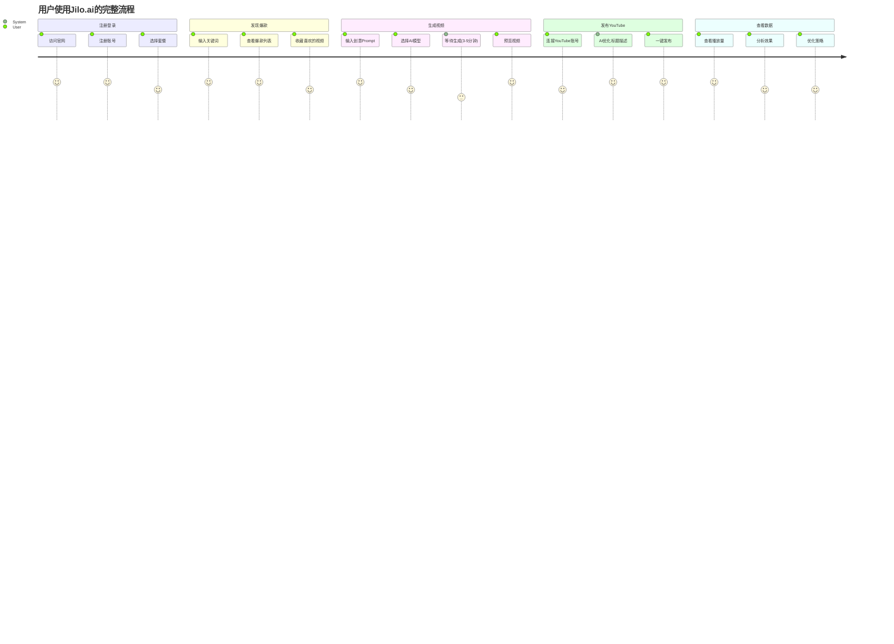

# 📋 产品需求文档 (Product Requirements Document)

> **项目名称**: Jilo.ai - AI视频内容自动化工厂  
> **版本**: V1.0  
> **创建日期**: 2024-11-19  
> **负责人**: Product Team  
> **状态**: ✅ 已批准

---

## 📑 目录

1. [产品概述](#1-产品概述)
2. [市场分析](#2-市场分析)
3. [用户画像](#3-用户画像)
4. [核心功能](#4-核心功能)
5. [用户流程](#5-用户流程)
6. [技术要求](#6-技术要求)
7. [商业模式](#7-商业模式)
8. [竞品分析](#8-竞品分析)
9. [成功指标](#9-成功指标)
10. [风险与挑战](#10-风险与挑战)

---

## 1. 产品概述

### 1.1 产品定位

**Jilo.ai** 是一个端到端的AI视频内容自动化平台，通过AI技术降低视频创作门槛，提升内容生产效率。

**核心价值主张**:
- 🎯 **选题不再难**: 自动发现TikTok/YouTube爆款视频
- ⚡ **创作更高效**: AI一键生成高质量短视频
- 🚀 **发布更智能**: 自动发布并优化SEO

### 1.2 产品愿景

**让每个人都能成为优秀的内容创作者**

我们相信，创作的障碍不应该是技术，而应该是创意本身。Jilo.ai通过AI自动化工具链，让创作者专注于创意，而非繁琐的制作流程。

### 1.3 解决的核心问题

| 痛点 | 现状 | Jilo.ai解决方案 |
|------|------|----------------|
| **选题困难** | 不知道拍什么内容容易火 | 爬取全平台爆款，AI分析热点趋势 |
| **制作耗时** | 拍摄+剪辑需要数小时 | AI生成视频，5分钟出片 |
| **发布繁琐** | 手动上传，SEO优化困难 | 自动发布+AI优化标题描述 |
| **效果难测** | 不知道哪种内容更受欢迎 | 数据分析+A/B测试 |

---

## 2. 市场分析

### 2.1 市场规模

**全球短视频市场**:
- 市场规模: $1200亿 (2024)
- 年增长率: 25%
- 预计2028年: $3000亿

**目标细分市场**:
- YouTube创作者: 5100万+
- TikTok创作者: 1.5亿+
- 企业营销账号: 2000万+

### 2.2 市场趋势

1. **AI内容生成快速普及**
   - Runway、Pika等AI视频工具获得巨额融资
   - 用户接受度快速提升

2. **短视频持续爆发**
   - YouTube Shorts日活5亿+
   - TikTok用户时长持续增长

3. **自动化工具需求旺盛**
   - Buffer、Hootsuite等调度工具估值数十亿
   - 创作者愿意为效率工具付费

### 2.3 市场机会

**为什么是现在?**

✅ AI生成技术成熟（Minimax、Runway、Kling）  
✅ 短视频平台流量红利期  
✅ 创作者变现需求强烈  
✅ 现有工具碎片化，缺乏一体化解决方案

---

## 3. 用户画像

### 3.1 主要用户群体

#### 👤 用户群体1: 兼职内容创作者

**基本信息**:
- 年龄: 25-35岁
- 职业: 上班族/自由职业者
- 收入: $3K-$8K/月

**特征**:
- 想通过副业增加收入
- 没有专业视频制作技能
- 时间有限（每周<10小时）

**需求**:
- 快速生成视频（<10分钟/条）
- 不需要学习复杂工具
- 价格敏感（$20-$50/月可接受）

**使用场景**:
周末花2小时，批量生成10条视频，定时发布到YouTube

---

#### 🏢 用户群体2: 企业营销团队

**基本信息**:
- 团队规模: 3-10人
- 行业: 电商、教育、SaaS
- 预算: $500-$2000/月

**特征**:
- 需要持续输出品牌内容
- 对质量和合规性要求高
- 重视ROI

**需求**:
- 批量生成能力（>100条/月）
- 多账号管理
- 数据分析和报表

**使用场景**:
营销经理每周一安排本周选题，团队成员分工生成，自动发布到品牌矩阵账号

---

#### 📱 用户群体3: 专业内容工作室

**基本信息**:
- 团队规模: 10-50人
- 业务: MCN机构、代运营公司
- 预算: $2000+/月

**特征**:
- 管理多个客户账号
- 对自动化和API集成需求高
- 重视数据安全和稳定性

**需求**:
- 企业级功能（团队协作、权限管理）
- API接口
- 专属客服和SLA保障

**使用场景**:
为50个客户账号同时运营，通过API集成到内部工作流

---

## 4. 核心功能

### 4.1 功能架构

```
Jilo.ai
├── 🔍 发现爆款 (Discover)
│   ├── 多平台爬取
│   ├── 智能过滤
│   ├── 爆款评分
│   └── 趋势分析
│
├── 🎬 AI生成 (Generate)
│   ├── 文生视频
│   ├── 批量生成
│   ├── 风格定制
│   └── 内容审查
│
├── 🚀 智能发布 (Publish)
│   ├── YouTube上传
│   ├── SEO优化
│   ├── 定时发布
│   └── 多账号管理
│
└── 📊 数据分析 (Analytics)
    ├── 实时监控
    ├── 效果追踪
    ├── ROI分析
    └── A/B测试
```

### 4.2 详细功能说明

#### 🔍 功能模块1: 发现爆款

**功能描述**:
自动爬取TikTok、YouTube Shorts、Instagram Reels的热门视频，通过AI分析评估爆款潜力。

**子功能**:

1. **多平台爬取**
   - 支持平台: TikTok、YouTube Shorts、Instagram Reels
   - 搜索方式: 关键词、话题标签、创作者
   - 数据字段: 标题、描述、播放量、点赞数、评论数、发布时间

2. **智能过滤**
   - 播放量范围: 10K - 10M+
   - 发布时间: 最近7天/30天/90天
   - 互动率阈值: >5%
   - 视频时长: 15s-60s

3. **爆款评分算法**
   ```
   爆款分数 = 
     播放量权重 (40%) + 
     互动率权重 (30%) + 
     增长速度权重 (20%) + 
     内容质量权重 (10%)
   ```

4. **趋势分析**
   - 热门话题提取
   - 常用BGM识别
   - 热门标签聚合
   - 内容类型分类

**优先级**: P0 (必须有)

**技术实现**: 
- Apify爬虫
- Google Gemini文本分析
- PostgreSQL存储

---

#### 🎬 功能模块2: AI视频生成

**功能描述**:
基于爆款视频或自定义Prompt，使用AI模型生成高质量短视频。

**子功能**:

1. **文生视频**
   - 输入: 文字描述 (Prompt)
   - 输出: 15s/30s/60s视频
   - 支持模型:
     - Minimax Video-01 (高性价比)
     - Runway Gen-3 (高质量)
     - Kling AI (中文优化)

2. **批量生成**
   - 一次提交10-100个任务
   - 队列管理
   - 并发控制

3. **风格定制**
   - 预设风格: 写实、动漫、艺术、科技
   - 自定义参数: 色调、节奏、镜头语言

4. **内容审查**
   - AI检测违规内容
   - 敏感词过滤
   - 用户行为监控

**优先级**: P0 (必须有)

**技术实现**:
- FAL.AI API
- Gemini内容审查
- Supabase Storage

---

#### 🚀 功能模块3: 智能发布

**功能描述**:
自动将生成的视频上传到YouTube，并进行SEO优化。

**子功能**:

1. **YouTube上传**
   - OAuth授权
   - 自动上传
   - 封面设置
   - 播放列表管理

2. **SEO优化**
   - AI生成标题（基于关键词研究）
   - AI生成描述（包含热门标签）
   - 智能标签推荐
   - 最佳发布时间建议

3. **定时发布**
   - 设置发布队列
   - 自动间隔发布
   - 时区智能调整

4. **多账号管理**
   - 绑定多个YouTube频道
   - 账号健康度监控
   - Token自动刷新

**优先级**: P0 (必须有)

**技术实现**:
- YouTube Data API v3
- Google OAuth 2.0
- Token加密存储

---

#### 📊 功能模块4: 数据分析

**功能描述**:
追踪视频表现，分析效果，优化内容策略。

**子功能**:

1. **实时监控**
   - 生成进度追踪
   - 发布状态监控
   - 系统健康检查

2. **效果追踪**
   - 播放量趋势
   - 互动数据（点赞/评论/分享）
   - 观众留存率

3. **ROI分析**
   - 生成成本统计
   - 流量价值估算
   - 投入产出比

4. **A/B测试**
   - 多版本对比
   - 标题/封面测试
   - 最优策略推荐

**优先级**: P1 (重要但非必须)

**技术实现**:
- YouTube Analytics API
- Recharts可视化
- PostgreSQL聚合查询

---

## 5. 用户流程

### 5.1 核心用户旅程



### 5.2 详细流程图

#### 流程1: 新用户注册

```
1. 用户访问首页
2. 点击「免费试用」按钮
3. 选择注册方式:
   - Google一键登录 ✅ (推荐)
   - 邮箱+密码注册
4. 填写基本信息:
   - 昵称
   - 使用目的（创作者/营销团队/其他）
5. 选择套餐:
   - Starter: $0/月（试用7天）
   - Standard: $29/月
   - Professional: $99/月
6. 完成支付（Stripe）
7. 跳转到Dashboard
```

#### 流程2: 发现并生成视频

```
1. 用户进入「发现」页面
2. 输入关键词（如: "AI工具"）
3. 选择平台: TikTok、YouTube Shorts
4. 点击「开始爬取」
5. 系统显示进度条（预计2-5分钟）
6. 展示爆款视频列表（按评分排序）
7. 用户点击某个视频
8. 查看详情:
   - 视频预览
   - 数据指标（播放量、点赞、评论）
   - AI分析（为什么火）
9. 点击「基于此生成」
10. 自动填充Prompt
11. 用户可以编辑Prompt
12. 选择AI模型和时长
13. 点击「开始生成」
14. 实时显示生成进度
15. 生成完成，跳转到视频列表
```

#### 流程3: 发布到YouTube

```
1. 用户进入「发布」页面
2. 如果未绑定YouTube:
   - 点击「连接YouTube账号」
   - OAuth授权
   - 选择频道
3. 选择要发布的视频
4. AI自动生成:
   - 优化后的标题（3个选项）
   - SEO描述
   - 推荐标签
5. 用户可以编辑
6. 上传自定义封面（可选）
7. 选择发布方式:
   - 立即发布
   - 定时发布（选择时间）
8. 点击「发布」
9. 系统自动上传
10. 显示发布成功，附带YouTube链接
```

---

## 6. 技术要求

### 6.1 性能要求

| 指标 | 要求 | 说明 |
|------|------|------|
| **页面加载** | <2秒 | 首屏加载时间 |
| **API响应** | <500ms | 非生成类API |
| **视频生成** | 3-10分钟 | 取决于视频时长和模型 |
| **并发用户** | 1000+ | 同时在线用户数 |
| **可用性** | 99.9% | 年度停机时间<8.76小时 |

### 6.2 安全要求

- ✅ 所有API必须通过身份验证
- ✅ 敏感数据必须加密存储（Token、密码）
- ✅ 配额必须原子扣费（防止并发超刷）
- ✅ 内容必须AI审查（防止违规）
- ✅ Webhook必须签名验证

### 6.3 兼容性要求

- **浏览器**: Chrome 90+, Safari 14+, Firefox 88+
- **移动端**: iOS 14+, Android 10+
- **屏幕尺寸**: 支持1024px-4K

---

## 7. 商业模式

### 7.1 订阅套餐

| 套餐 | 价格 | 月视频数 | 核心功能 | 目标用户 |
|------|------|----------|----------|----------|
| **Starter** | $29/月 | 20个 | 基础功能 | 个人创作者 |
| **Standard** | $79/月 | 100个 | +批量生成 | 兼职创作者 |
| **Professional** | $199/月 | 500个 | +团队协作 | 企业团队 |
| **Enterprise** | 定制 | 无限 | +API+专属客服 | 大客户 |

### 7.2 收入预测

**第一年目标** (保守估计):

```
月份1-3: 100用户 × $50平均单价 = $5,000 MRR
月份4-6: 500用户 × $50 = $25,000 MRR
月份7-9: 1500用户 × $60 = $90,000 MRR
月份10-12: 3000用户 × $60 = $180,000 MRR

年度ARR: ~$1,000,000
```

### 7.3 成本结构

**月度成本** (假设3000用户):

```
AI生成成本: 
- FAL.AI: 3000用户 × 100视频/月 × $0.05/视频 = $15,000

基础设施:
- Vercel Pro: $20
- Supabase Pro: $25
- Apify: $500

人力成本:
- 开发: 2人 × $8,000 = $16,000
- 运营: 1人 × $5,000 = $5,000

营销成本:
- 广告: $10,000

总成本: ~$46,545
利润: $180,000 - $46,545 = $133,455
利润率: 74%
```

---

## 8. 竞品分析

### 8.1 主要竞品

| 产品 | 定位 | 优势 | 劣势 | 价格 |
|------|------|------|------|------|
| **Runway** | AI视频生成 | 质量高 | 无爬取/发布功能 | $15-$95/月 |
| **Descript** | 视频编辑 | 功能全面 | 学习曲线陡峭 | $24-$50/月 |
| **Opus Clip** | 长视频切片 | 自动剪辑 | 不生成新内容 | $29-$129/月 |
| **Buffer** | 社媒调度 | 多平台 | 无视频生成 | $6-$120/月 |

### 8.2 Jilo.ai的差异化优势

✅ **一体化解决方案**: 从选题到发布全流程  
✅ **爆款发现**: 竞品没有爬取+分析能力  
✅ **AI内容审查**: 保护用户账号安全  
✅ **价格优势**: 性价比高  

---

## 9. 成功指标

### 9.1 北极星指标

**月度生成视频总数** (Monthly Generated Videos)

这个指标代表用户实际使用产品的核心价值。

### 9.2 关键指标

| 指标 | 定义 | 目标 (第一年) |
|------|------|---------------|
| **MRR** | 月度经常性收入 | $180K |
| **付费用户数** | 订阅用户总数 | 3,000 |
| **日活用户** | 每日登录用户 | 1,500 |
| **生成视频数** | 月度生成总数 | 300K |
| **发布成功率** | 成功发布/总发布 | >95% |
| **用户留存率** | 次月留存率 | >60% |
| **NPS** | 净推荐值 | >50 |

---

## 10. 风险与挑战

### 10.1 技术风险

| 风险 | 影响 | 缓解措施 |
|------|------|----------|
| **AI模型不稳定** | 生成失败率高 | 多模型备份，降级策略 |
| **爬虫被封** | 无法获取数据 | 分布式IP，遵守robots.txt |
| **YouTube API限制** | 发布失败 | 配额监控，多账号轮换 |

### 10.2 商业风险

| 风险 | 影响 | 缓解措施 |
|------|------|----------|
| **竞品模仿** | 市场份额下降 | 快速迭代，建立壁垒 |
| **用户增长缓慢** | 无法盈利 | 加大营销，优化转化 |
| **监管政策** | 合规风险 | 内容审查，法律咨询 |

### 10.3 运营风险

| 风险 | 影响 | 缓解措施 |
|------|------|----------|
| **恶意用户** | 平台声誉受损 | AI审查，用户行为监控 |
| **服务器宕机** | 用户流失 | 多区域部署，监控告警 |
| **成本超支** | 现金流断裂 | 成本优化，融资储备 |

---

## 📎 附录

### A. 术语表

- **MRR**: Monthly Recurring Revenue (月度经常性收入)
- **ARR**: Annual Recurring Revenue (年度经常性收入)
- **NPS**: Net Promoter Score (净推荐值)
- **DAU**: Daily Active Users (日活跃用户)
- **SEO**: Search Engine Optimization (搜索引擎优化)

### B. 参考资料

- [TikTok趋势报告 2024](https://www.tiktok.com/business/trends)
- [YouTube创作者经济报告](https://www.youtube.com/creators)
- [AI视频生成市场研究](https://www.grandviewresearch.com)

---

<div align="center">

**文档版本**: V1.0  
**最后更新**: 2024-11-19  
**审批状态**: ✅ 已批准

[返回目录](#-目录) | [查看技术文档](./TECHNICAL_IMPLEMENTATION.md)

</div>