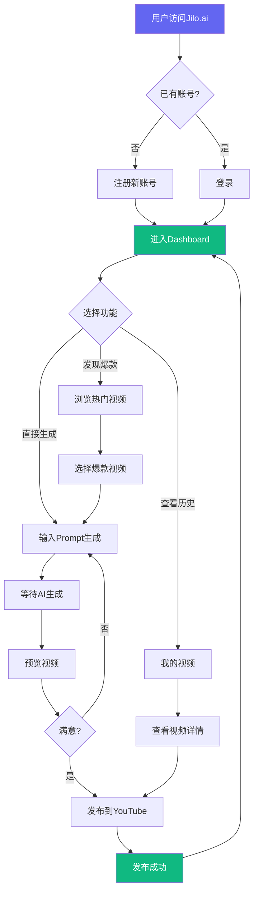
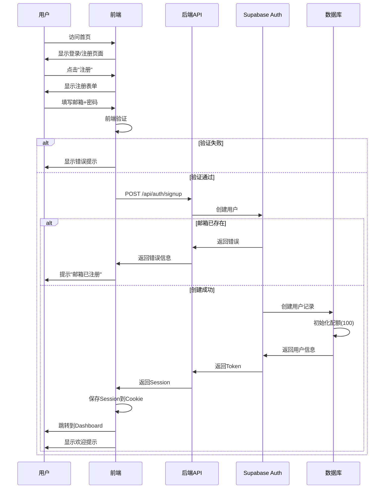
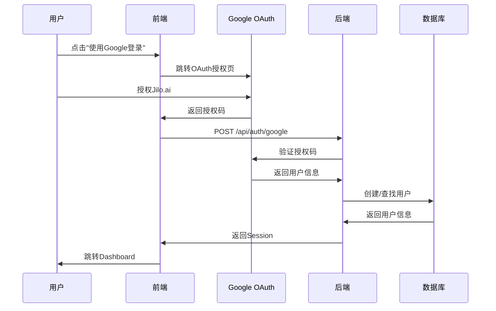
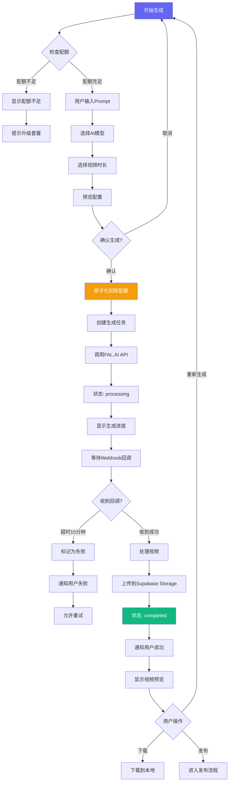
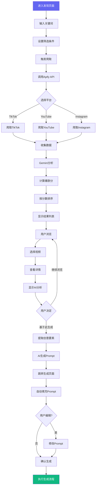
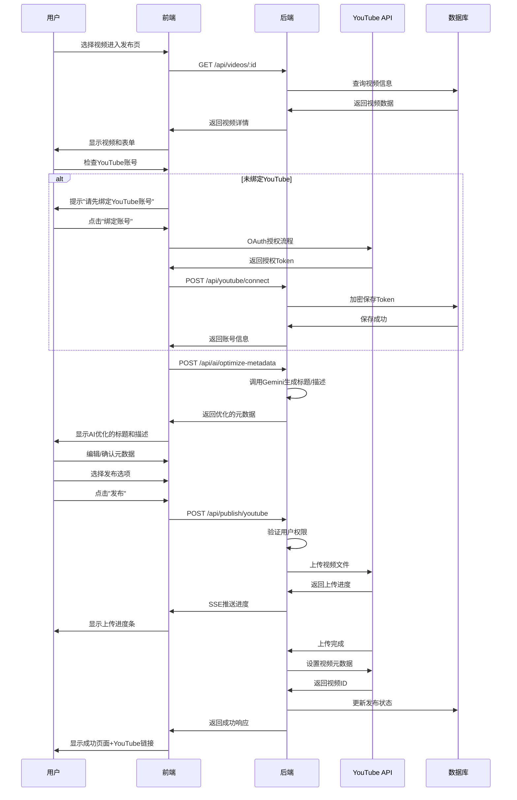
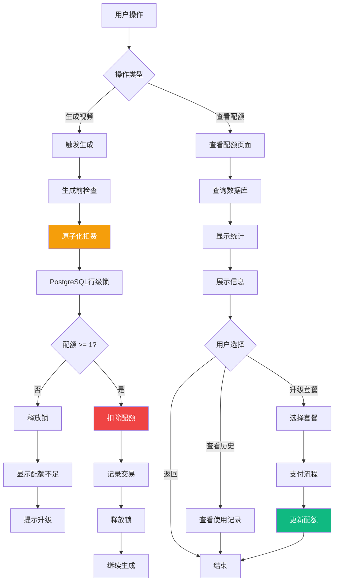
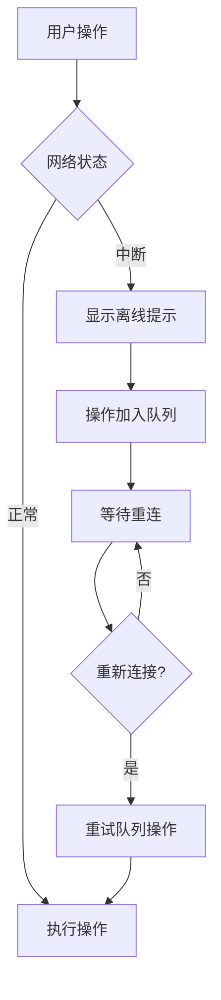

# 🔄 用户流程图 (User Flows)

> **文档目的**: 详细描述Jilo.ai各个功能模块的用户操作流程  
> **创建日期**: 2024-11-19  
> **版本**: V1.0

---

## 📋 目录

1. [核心流程概览](#核心流程概览)
2. [详细用户流程](#详细用户流程)
   - [新用户注册流程](#1-新用户注册流程)
   - [视频生成完整流程](#2-视频生成完整流程)
   - [爆款发现到生成流程](#3-爆款发现到生成流程)
   - [视频发布流程](#4-视频发布流程)
   - [配额管理流程](#5-配额管理流程)
3. [异常流程处理](#异常流程处理)

---

## 核心流程概览

### 产品使用总览



---

## 详细用户流程

### 1. 新用户注册流程

#### 流程图



#### 详细步骤

**步骤1: 访问注册页面**
- 用户点击"免费试用"或"注册"按钮
- 系统检查是否已登录
- 如已登录，直接跳转Dashboard
- 如未登录，显示注册表单

**步骤2: 填写注册信息**
- 必填字段:
  - 邮箱地址
  - 密码（至少8位）
  - 密码确认
- 可选字段:
  - 昵称（默认使用邮箱前缀）
  - 使用目的（创作者/营销团队/其他）

**步骤3: 前端验证**
- 邮箱格式验证
- 密码强度检查（至少8位，包含字母+数字）
- 密码确认匹配检查
- 实时显示验证结果

**步骤4: 提交注册**
- 显示loading状态
- 调用注册API
- 等待响应

**步骤5: 处理响应**
- 成功:
  - 自动登录
  - 保存Session
  - 跳转Dashboard
  - 显示新手引导（可选）
- 失败:
  - 显示具体错误信息
  - 允许修改后重试

**步骤6: 首次登录体验**
- 显示欢迎弹窗
- 展示新手教程（可跳过）
- 提供快速入门任务
- 引导完成首个视频生成

#### 替代流程：Google OAuth注册



---

### 2. 视频生成完整流程

#### 流程图



#### 详细步骤说明

**阶段1: 配置生成参数 (1-2分钟)**

```
步骤1.1: 进入生成页面
- 检查用户配额
- 如配额不足，显示升级提示
- 加载用户历史Prompt（可选）

步骤1.2: 输入视频描述
- 最少10个字符
- 最多500个字符
- 显示字数统计
- 提供Prompt模板（可选）
- 实时保存草稿

步骤1.3: 选择AI模型
选项:
- Minimax Video-01 (推荐)
  速度: ⚡⚡⚡
  质量: ⭐⭐⭐
  成本: 💰
  
- Runway Gen-3
  速度: ⚡⚡
  质量: ⭐⭐⭐⭐⭐
  成本: 💰💰💰
  
- Kling AI
  速度: ⚡⚡
  质量: ⭐⭐⭐⭐
  成本: 💰💰

步骤1.4: 选择视频时长
- 15秒 (快速测试)
- 30秒 (推荐)
- 60秒 (完整内容)

步骤1.5: 高级选项（可选）
- 视频风格
- 色调设置
- 节奏控制
```

**阶段2: 提交生成 (瞬间)**

```
步骤2.1: 点击生成按钮
- 禁用表单
- 显示loading

步骤2.2: 前端验证
- Prompt长度检查
- 模型选择检查
- 配额检查

步骤2.3: 调用后端API
POST /api/generate
{
  prompt: "...",
  model: "minimax",
  duration: 30,
  userId: "..."
}

步骤2.4: 后端处理
1. 验证Session
2. 原子化扣除配额 (使用PostgreSQL锁)
3. 内容审查 (检测敏感词)
4. 创建任务记录
5. 调用FAL.AI API
6. 立即返回任务ID

步骤2.5: 前端响应
- 保存任务ID
- 跳转到进度页面
- 开始轮询状态
```

**阶段3: 生成中 (3-10分钟)**

```
步骤3.1: 显示生成进度
进度阶段:
1. 正在分析Prompt (0-20%)
2. 生成视频帧 (20-80%)
3. 渲染合成 (80-100%)

显示内容:
- 进度条
- 当前步骤
- 预计剩余时间
- [取消生成] 按钮

步骤3.2: 实时状态更新
方式: Supabase Realtime订阅
频率: 实时推送
内容: 任务状态变化

步骤3.3: FAL.AI处理
- 接收Prompt
- 生成视频
- 完成后调用Webhook

步骤3.4: Webhook回调
POST /api/webhooks/fal
Headers:
  x-fal-signature: [HMAC签名]
Body:
  {
    request_id: "...",
    status: "completed",
    video_url: "..."
  }

步骤3.5: 后端处理回调
1. 验证Webhook签名
2. 检查幂等性（防止重复）
3. 下载视频文件
4. 上传到Supabase Storage
5. 更新任务状态
6. 触发Realtime推送
```

**阶段4: 生成完成 (瞬间)**

```
步骤4.1: 前端收到更新
- Realtime推送通知
- 更新UI状态

步骤4.2: 加载视频
- 获取视频URL
- 初始化播放器
- 显示操作按钮

步骤4.3: 用户操作选项
- 预览视频
- 重新生成
- 下载到本地
- 发布到YouTube
- 删除视频
```

#### 异常处理

**情况1: 配额不足**
```
检测: 生成前检查
提示: "配额不足，本月剩余X个"
操作: [升级套餐] 或 [等待下月刷新]
```

**情况2: 生成超时**
```
检测: 15分钟未收到回调
处理: 
  1. 标记任务为failed
  2. 通知用户
  3. 不退回配额（已消耗）
  4. 提供免费重试1次机会
```

**情况3: 内容审查不通过**
```
检测: 提交时检测敏感词
提示: "Prompt包含不当内容: [具体词汇]"
操作: 修改后重新提交
配额: 未扣除
```

**情况4: FAL.AI服务异常**
```
检测: Webhook返回error状态
处理:
  1. 自动重试3次
  2. 仍失败则标记任务失败
  3. 退回配额
  4. 记录日志供运维排查
```

---

### 3. 爆款发现到生成流程

#### 流程图



#### 详细步骤说明

**阶段1: 搜索爆款视频**

```
步骤1.1: 输入搜索关键词
示例:
- "AI工具"
- "ChatGPT教程"
- "科技评测"

步骤1.2: 设置筛选条件
平台选择:
☑️ TikTok
☑️ YouTube Shorts
☐ Instagram Reels

播放量范围:
▓▓▓▓▓░░░░░ 100K - 10M

发布时间:
○ 最近7天
● 最近30天
○ 最近90天

步骤1.3: 点击搜索
- 显示loading动画
- 调用后端API
- API触发Apify爬虫
```

**阶段2: 爬取和分析**

```
后端流程:

1. 接收搜索请求
POST /api/discover/search
{
  keyword: "AI工具",
  platforms: ["tiktok", "youtube"],
  views_min: 100000,
  views_max: 10000000,
  days: 30
}

2. 调用Apify Actor
// TikTok
apify.call('apify/tiktok-scraper', {
  searchQueries: ["AI工具"],
  resultsLimit: 50
})

// YouTube
apify.call('apify/youtube-scraper', {
  searchKeywords: ["AI工具 shorts"],
  maxResults: 50
})

3. 收集数据
返回字段:
- video_id
- title
- description
- views
- likes
- comments
- shares
- publish_date
- thumbnail_url
- video_url (如可用)

4. AI分析 (Gemini)
对每个视频:
prompt = `
分析这个视频为什么会火:
标题: ${title}
描述: ${description}
数据: ${views}播放, ${likes}点赞

请输出:
1. 核心吸引点 (1-2句话)
2. 成功要素 (3-5个关键词)
3. 推荐指数 (1-10分)
`

5. 计算爆款分
公式:
score = 
  views_weight * 40% +
  engagement_rate * 30% +
  growth_speed * 20% +
  ai_quality * 10%

6. 排序并返回
按爆款分降序
```

**阶段3: 浏览和选择**

```
步骤3.1: 显示结果
网格布局，每个卡片显示:
- 视频缩略图
- 爆款分 (98/100)
- 平台标识
- 标题
- 播放量 + 点赞数
- [基于此生成] 按钮

步骤3.2: 用户点击视频
打开详情弹窗:
┌─────────────────────────┐
│ [视频播放器]            │
├─────────────────────────┤
│ 基本信息:               │
│ • 标题                  │
│ • 作者                  │
│ • 发布时间              │
│                         │
│ 📊 数据分析:            │
│ • 播放量: 8.2M          │
│ • 点赞率: 3.9%          │
│ • 评论数: 12.5K         │
│                         │
│ 🤖 AI分析:             │
│ 这个视频成功的原因:     │
│ 1. 标题使用数字...      │
│ 2. 开头3秒直击痛点...   │
│ 3. 节奏紧凑...          │
│                         │
│ [基于此生成]  [收藏]   │
└─────────────────────────┘

步骤3.3: 点击"基于此生成"
系统自动:
1. 提取视频的成功要素
2. 使用Gemini生成Prompt
3. 跳转到生成页面
4. 自动填充Prompt
```

**阶段4: Prompt生成和填充**

```
Gemini Prompt模板:

"""
基于以下爆款视频，生成一个新的视频创意Prompt:

原视频信息:
- 标题: ${title}
- 描述: ${description}
- 成功要素: ${ai_analysis}

请生成一个详细的视频Prompt，要求:
1. 保留核心创意和叙事结构
2. 避免直接抄袭内容
3. 适合AI视频生成（文生视频）
4. 包含视觉描述和镜头语言
5. 长度100-300字

输出格式: 纯文本Prompt
"""

生成示例:

输入: "10个最实用的ChatGPT插件推荐"

输出Prompt:
"创建一个30秒的科技推荐视频。开场显示动态的AI
图标，配合科技感背景音乐。依次展示5个AI工具的图标
和名称，每个工具停留5秒。使用简洁的文字说明每个
工具的核心功能。最后以'关注获取更多AI工具'的字幕
结束。整体风格现代、动感，色调以蓝色和紫色为主。"
```

---

### 4. 视频发布流程

#### 流程图



#### 详细步骤说明

**阶段1: YouTube账号绑定（首次）**

```
步骤1.1: 检测YouTube绑定状态
查询: SELECT * FROM youtube_connections 
       WHERE user_id = ?

步骤1.2: 如未绑定，触发OAuth流程
1. 跳转YouTube OAuth授权页
   URL: https://accounts.google.com/o/oauth2/v2/auth
   scope: youtube.upload, youtube.readonly
   
2. 用户授权后回调
   callback: /api/auth/youtube/callback?code=...
   
3. 后端交换Token
   POST https://oauth2.googleapis.com/token
   {
     code: "...",
     client_id: "...",
     client_secret: "...",
     redirect_uri: "...",
     grant_type: "authorization_code"
   }
   
4. 加密保存Token
   使用AES-256-GCM加密:
   - access_token (加密)
   - refresh_token (加密)
   - expires_at
   - channel_id
   - channel_name

5. 显示绑定成功
   "✓ 已连接YouTube频道: @channelname"
```

**阶段2: AI优化元数据**

```
步骤2.1: 自动生成标题
Gemini Prompt:
"""
为这个视频生成3个YouTube标题选项:

视频Prompt: ${original_prompt}
视频时长: ${duration}秒

要求:
1. 吸引眼球，包含数字或问题
2. 包含1-2个热门关键词
3. 长度50-100字符
4. 适当使用表情符号

输出格式: JSON数组
[
  "标题选项1",
  "标题选项2",
  "标题选项3"
]
"""

步骤2.2: 生成视频描述
"""
为YouTube视频生成完整描述:

视频内容: ${prompt}
关键词: ${keywords}

要求:
1. 第一段简明介绍视频内容
2. 包含时间戳（如适用）
3. 添加相关话题标签（3-5个）
4. 包含社交媒体链接区域
5. 总长度300-500字

输出格式: 纯文本
"""

步骤2.3: 推荐标签
基于:
- 视频内容分析
- 热门标签数据库
- 相似视频的标签

生成: 10-15个相关标签
```

**阶段3: 配置发布选项**

```
表单字段:

1. 标题 (必填)
   - 最多100字符
   - 显示字数统计
   - 提供3个AI生成选项

2. 描述 (必填)
   - 最多5000字符
   - 支持Markdown格式
   - AI自动生成，可编辑

3. 标签 (可选)
   - 最多15个
   - 每个标签最多30字符
   - 显示推荐标签

4. 缩略图 (可选)
   - 上传自定义: 支持JPG/PNG
   - 使用默认: 视频第一帧
   - AI生成: 基于内容生成

5. 发布方式
   ○ 立即发布
   ● 定时发布: [日期] [时间]

6. 可见性
   ● 公开
   ○ 不公开
   ○ 私享

7. 播放列表 (可选)
   [选择现有播放列表 ▼]
   或 [+ 创建新播放列表]

8. 高级选项
   - 自动字幕: ✓ 启用
   - 允许评论: ✓ 是
   - 年龄限制: 无
```

**阶段4: 执行发布**

```
步骤4.1: 前端提交
POST /api/publish/youtube
{
  video_id: "...",
  youtube_channel_id: "...",
  metadata: {
    title: "...",
    description: "...",
    tags: [...],
    category: "28", // Science & Technology
    privacy: "public",
    publish_at: null // 或 ISO时间字符串
  },
  thumbnail: {
    type: "custom",
    file_url: "..."
  }
}

步骤4.2: 后端处理
1. 验证用户权限
2. 检查YouTube Token是否有效
3. 如Token过期，使用refresh_token刷新
4. 获取视频文件URL
5. 开始上传流程

步骤4.3: 上传到YouTube
使用YouTube Data API v3:

// 1. 初始化上传会话
POST https://www.googleapis.com/upload/youtube/v3/videos
Headers:
  Authorization: Bearer ${access_token}
  Content-Type: application/json
Body:
  {
    snippet: {
      title: "...",
      description: "...",
      tags: [...],
      categoryId: "28"
    },
    status: {
      privacyStatus: "public",
      publishAt: "..." // 定时发布
    }
  }

// 2. 上传视频文件
PUT ${upload_url}
Headers:
  Content-Type: video/*
Body: [视频文件流]

// 3. 监控上传进度
每1秒检查一次进度
通过SSE推送给前端:
{
  uploaded: 1024000,  // 已上传字节
  total: 10240000,    // 总字节
  percentage: 10      // 百分比
}

// 4. 上传完成后设置缩略图
POST https://www.googleapis.com/youtube/v3/thumbnails/set
{
  videoId: "...",
  media: [缩略图文件]
}

步骤4.4: 更新数据库
UPDATE video_generation_tasks
SET 
  published_to_youtube = true,
  youtube_video_id = '...',
  youtube_url = '...',
  published_at = NOW()
WHERE id = ?

步骤4.5: 返回成功响应
{
  success: true,
  youtube_video_id: "...",
  youtube_url: "https://www.youtube.com/watch?v=...",
  status: "published",
  estimated_processing_time: "5-10 minutes"
}
```

**阶段5: 发布后**

```
步骤5.1: 显示成功页面
┌─────────────────────────┐
│    ✓ 发布成功！          │
│                         │
│ 视频已发布到YouTube      │
│                         │
│ [在YouTube查看] 按钮    │
│                         │
│ 📊 预计数据:            │
│ • 审核时间: 5-10分钟    │
│ • 建议发布时间: 晚8点    │
│ • 预计首日播放: 500-2K  │
│                         │
│ [返回Dashboard]         │
│ [继续发布其他视频]      │
└─────────────────────────┘

步骤5.2: 后续跟踪（可选功能）
- 自动获取视频统计数据
- 每小时同步一次
- 在Dashboard显示播放量、点赞数
```

---

### 5. 配额管理流程

#### 流程图



#### 原子化配额扣除详解

**核心SQL函数**:

```sql
CREATE OR REPLACE FUNCTION atomic_deduct_quota(
  p_user_id UUID,
  p_amount INTEGER
) RETURNS BOOLEAN AS $$
DECLARE
  v_current_quota INTEGER;
BEGIN
  -- 🔒 关键: 使用FOR UPDATE锁定用户行
  SELECT quota INTO v_current_quota
  FROM users
  WHERE id = p_user_id
  FOR UPDATE;
  
  -- 检查配额是否足够
  IF v_current_quota < p_amount THEN
    -- 配额不足，回滚事务
    RETURN FALSE;
  END IF;
  
  -- 扣除配额
  UPDATE users
  SET quota = quota - p_amount,
      updated_at = NOW()
  WHERE id = p_user_id;
  
  -- 记录交易
  INSERT INTO quota_transactions (
    user_id,
    amount,
    type,
    created_at
  ) VALUES (
    p_user_id,
    -p_amount,
    'video_generation',
    NOW()
  );
  
  RETURN TRUE;
END;
$$ LANGUAGE plpgsql;
```

**使用方式**:

```typescript
// 后端代码
async function generateVideo(userId: string, prompt: string) {
  // 原子化扣费
  const deductSuccess = await db.rpc('atomic_deduct_quota', {
    p_user_id: userId,
    p_amount: 1
  });
  
  if (!deductSuccess) {
    throw new Error('Insufficient quota');
  }
  
  // 确保配额已扣除后，再调用FAL.AI
  const video = await falai.generate(prompt);
  
  return video;
}
```

**并发安全性测试**:

```
场景: 用户配额=10，并发100个请求

没有行级锁:
✗ 可能生成100个视频
✗ 配额变为负数
✗ 财务损失

使用行级锁:
✓ 只生成10个视频
✓ 配额精确为0
✓ 后续90个请求被拒绝
```

---

## 异常流程处理

### 1. 网络中断处理



### 2. 支付失败处理

```
步骤1: 用户尝试升级套餐
步骤2: 跳转Stripe支付页面
步骤3: 支付失败

原因分类:
1. 卡片余额不足
   → 提示用户更换支付方式
   
2. 卡片被拒绝
   → 联系银行或使用其他卡片
   
3. 网络超时
   → 刷新页面重试
   
4. 重复支付
   → 检查是否已成功，避免重复扣费
```

### 3. API限流处理

```
触发条件:
- FAL.AI: 100请求/分钟
- YouTube: 10000配额/天
- Gemini: 60请求/分钟

处理策略:
1. 检测429状态码
2. 读取Retry-After头
3. 显示等待时间
4. 自动重试
5. 如持续失败，降级到备用方案
```

---

<div align="center">

**文档版本**: V1.0  
**最后更新**: 2024-11-19  

[返回文档目录](../README.md) | [查看原型设计](./PROTOTYPE.md) | [查看组件规范](./UI_COMPONENTS.md)

</div>
